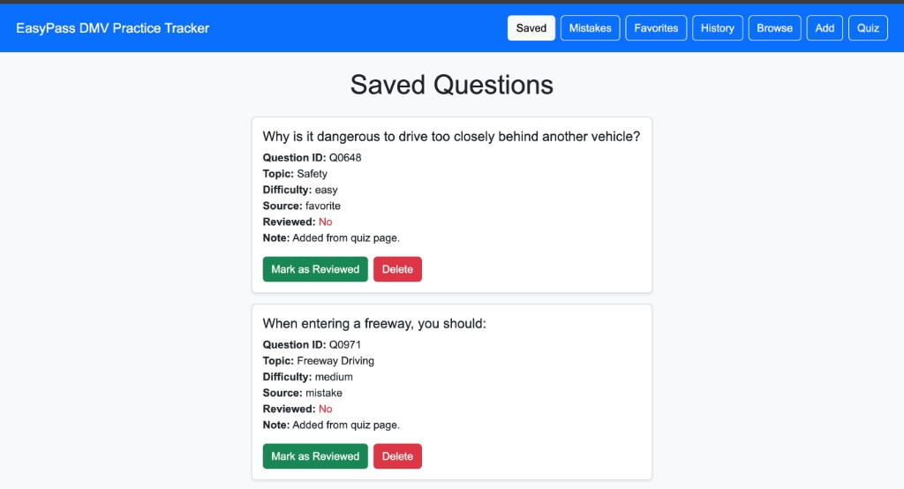
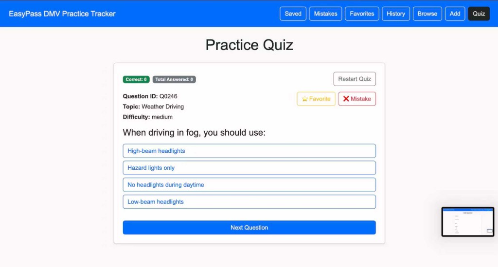
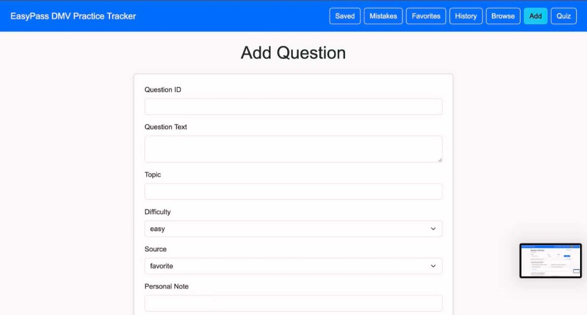
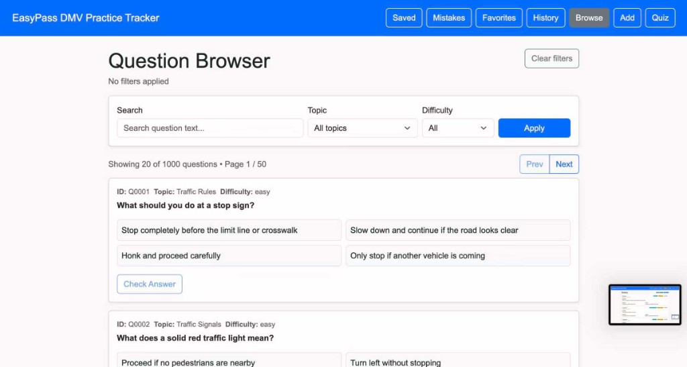
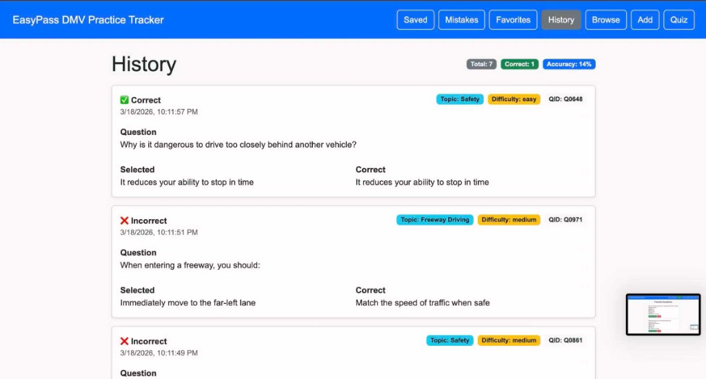
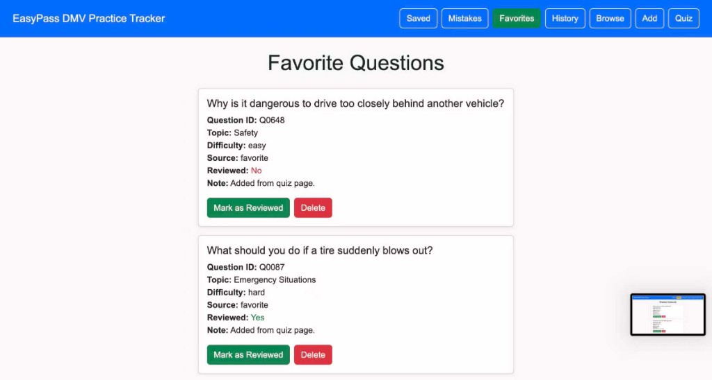
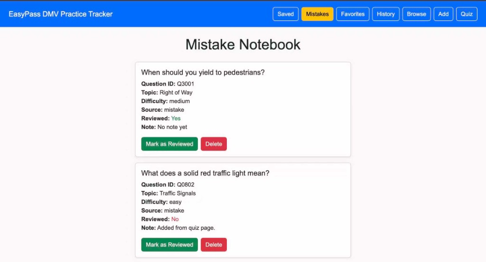

# EasyPass DMV Practice Tracker

**Author**:  Zihan Guo Fanchao Yu
**Class link**: 5610 Web Development/ https://johnguerra.co/classes/webDevelopment_online_spring_2026/

Client-side rendered React app (hooks) + Node/Express + MongoDB. Users can practice DMV-style questions, track attempts, save questions to favorites/mistakes, and browse/filter the full question bank by topic and difficulty.

---

## Project objective

- Help learners **focus practice** by topic/difficulty.
- Track performance over time via **attempt history**.
- Provide lightweight “study lists” via **Favorites** and **Mistake Notebook**.

---

## Screenshot















---

## Deployed app

- **Frontend (Vercel)**: `https://easypass-dmv-practice-tracker.vercel.app`  
- **Backend (Render)**: `https://easypass-dmv-practice-tracker.onrender.com`

---

## How to use (for end users)

### 1) Browse the question bank (filter by topic & difficulty)

1. Click **Browse** in the navbar (URL: `/questions`).
2. Use the filters at the top:
   - **Search**: type keywords to search in the question text (example: `stop sign`)
   - **Topic**: choose a topic (example: `Traffic Signals`)
   - **Difficulty**: choose `easy`, `medium`, or `hard`
3. Click **Apply** to run the search.
4. Use **Prev / Next** to move between pages.
5. Click **Clear filters** to reset back to the full list.

### 2) Practice with Quiz

1. Click **Quiz** in the navbar (URL: `/quiz`).
2. Read the question and click an answer choice.
3. You’ll immediately see whether it’s **Correct** or **Incorrect** and the **Correct answer** (if you missed it).
4. Click **Next Question** to load another random question.
5. Click **Restart Quiz** to reset your Correct/Total counters.

### 3) Save questions to study later (Favorites / Mistakes)

While on **Quiz**:

- Click **⭐ Favorite** to save the current question to your Favorites list.
- Click **❌ Mistake** to save the current question to your Mistake Notebook.

### 4) Review saved lists (Saved / Favorites / Mistakes)

1. Click **Saved**, **Favorites**, or **Mistakes** in the navbar.
2. On each saved question card you can:
   - **Mark Reviewed** (sets the question as reviewed)
   - **Delete** (removes it from the list)

### 5) View attempt history

1. Click **History** in the navbar (URL: `/history`).
2. Review your recent attempts (newest first), including whether each attempt was correct.

## Main Features

- Random DMV-style quiz practice
- Question browser with topic and difficulty filters
- Search by question text
- Saved questions system
- Favorites list
- Mistake notebook
- Attempt history tracking
- Review status updates for saved questions

--- 

## Tech stack

- **Frontend**: React (hooks), React Router, Vite, Bootstrap, PropTypes
- **AJAX**: Browser `fetch` API (no axios)
- **Backend**: Node.js, Express, `dotenv`, `cors`
- **Database**: MongoDB (native driver, `mongodb`)
- **Tooling**: ESLint (frontend flat config), Prettier (installed in `server` devDependencies)
- **Deployment**: Vercel (frontend) + Render (backend)

---

## Database & collections (MongoDB)

Database name: `easypass` (see `server/config/db.js`)

Collections used:

- **`questions`**: question bank (seeded with synthetic data; 1000+ records).
- **`savedQuestions`**: saved items (favorites/mistakes) with notes and review status.
- **`attempts`**: quiz attempt history.

Seed script:

- `server/seedQuestions.js` generates **1000** synthetic questions and inserts into `questions`.

---

## API overview (AJAX)

Base URL:

- In production set `VITE_API_BASE_URL` on the frontend, or rely on default in `client/src/services/config.js`.

Questions:

- `GET /api/questions/random` — get a random question
- `GET /api/questions` — list questions with filters + pagination  
  - query: `topic`, `difficulty`, `q`, `page`, `limit`
- `GET /api/questions/meta` — topics/difficulties for filter UI

Saved Questions:

- `GET /api/saved-questions`
- `POST /api/saved-questions`
- `DELETE /api/saved-questions/:id`
- `PUT /api/saved-questions/:id/review`

Attempts:

- `GET /api/attempts`
- `POST /api/attempts`

---

## React components (hooks)

Examples (each in its own file):

- `client/src/components/Navbar/Navbar.jsx`
- `client/src/components/SavedQuestionCard/SavedQuestionCard.jsx`
- `client/src/pages/QuizPage/QuizPage.jsx`
- `client/src/pages/QuestionBrowserPage/QuestionBrowserPage.jsx`

---

## Project structure

```
client/                 # React frontend (Vite)
  src/
    components/         # Reusable UI components (+ per-component CSS)
    pages/              # Route pages
    services/           # AJAX helpers (fetch)

server/                 # Express backend
  routes/               # Express routers
  config/               # DB connection config
  seedQuestions.js      # Generates 1000 synthetic questions
```

CSS organization:

- Component/page styles live alongside the component/page (e.g. `Navbar.jsx` + `Navbar.css`).

---

## Setup instructions (build & run locally)

### Prerequisites

- Node.js (recommend latest LTS)
- MongoDB connection string (MongoDB Atlas or local MongoDB)

### 1) Backend

From `server/`:

1. Install deps:

```bash
cd server
npm install
```

2. Create environment variables:

- Create `server/.env` (do **not** commit it)
- Add:

```bash
MONGO_URI="your-mongodb-connection-string"
PORT=4000
```

3. Start the server:

```bash
node server.js
```

### 2) Seed the database (1000 synthetic questions)

```bash
cd server
node seedQuestions.js
```

### 3) Frontend

From `client/`:

1. Install deps:

```bash
cd client
npm install
```

2. (Optional) Point frontend to your local backend:

```bash
VITE_API_BASE_URL="http://localhost:4000"
```

3. Start the dev server:

```bash
npm run dev
```


---

## ESLint / Prettier

- Frontend ESLint: `client/eslint.config.js`  
  - Run: `cd client && npm run lint`
- Prettier is installed in `server` (`server/package.json`).  
  - If you want formatting scripts, add `format` / `check-format` scripts (recommended).

---


### Project description

EasyPass is a DMV practice tracker that makes it easy to:

- Practice randomized questions
- Save questions into Favorites / Mistakes for later review
- Track attempt history over time
- Browse and filter the full question bank by topic and difficulty

### User personas

1) **Busy commuter (Alex, 24)**  
Needs short, focused practice sessions on weak areas (e.g., “Traffic Signals”, “Hard”).

2) **First-time driver (Mei, 17)**  
Wants repetition and a simple mistake notebook to review common errors.

3) **Test retaker (Jordan, 31)**  
Wants to measure progress, review past attempts, and drill topics that caused failure.

### User stories

- As a learner, I want to **browse and filter questions by topic and difficulty** so I can focus on a specific area.
- As a learner, I want to **practice a random question** so I can simulate exam conditions.
- As a learner, I want to **save a question as a favorite** so I can review it later.
- As a learner, I want to **save questions I missed** so I can build a mistake notebook.
- As a learner, I want to **see my attempt history** so I can measure improvement over time.
- As a learner, I want to **mark saved questions as reviewed** so I can track what I’ve already studied.

### Design mockups

Add mockups (hand-drawn or Figma screenshots) to `docs/mockups/` and link them here.

- `docs/mockups/question-browser.png`
- `docs/mockups/quiz.png`
- `docs/mockups/saved.png`

Wireframe description:

- **Navbar**: Saved / Mistakes / Favorites / History / Add / Quiz / Browse
- **Question Browser**: Search + Topic dropdown + Difficulty dropdown + Apply/Clear + results list + pagination
- **Quiz**: Question card + answer choices + correctness feedback + Favorite/Mistake actions

---


## License

MIT License. See `LICENSE`.